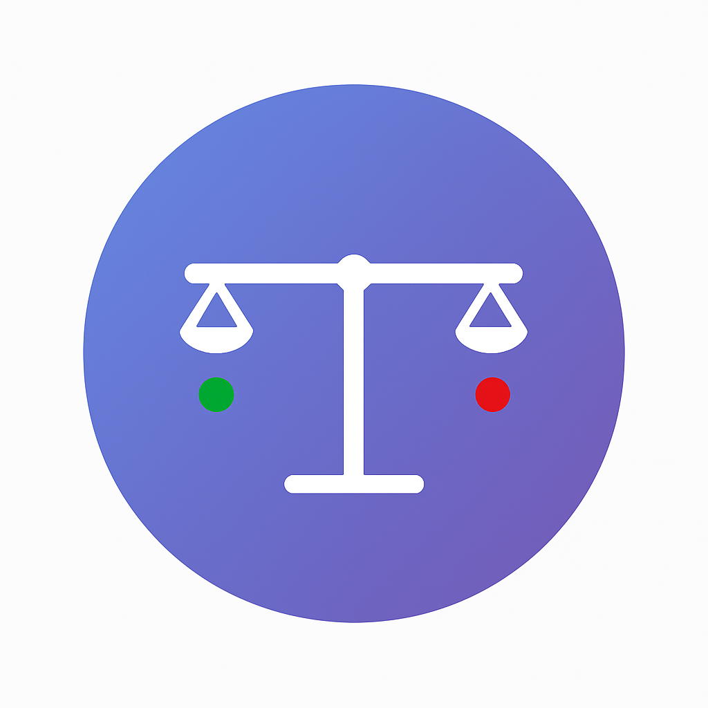

# ⚖️ Hybrid Background Removal Evaluator App

  

  
  **Background Removal Quality Assessment Tool**
  
  )

## 💬 About

Hybrid Background Removal Evaluator App is a Streamlit web application designed to validate AI-generated background removal scores for images through human-in-the-loop review. It combines automated quality assessment with manual oversight to ensure production-level readiness. Annotators are presented with side-by-side views of original and processed images, along with the AI’s rating based on a consistent 5-point rubric. They can agree with the score via a simple thumbs-up or flag a disagreement by thumbs down and submitting an alternative score. The tool also includes magnifying functionality for closer inspection, making it easier to spot edge artifacts or incomplete extractions. All interactions follow the same rubric used by the AI, ensuring consistency across evaluations. An analysis dashboard provides executive summary, insights into agreement rates, and actionable recommendations, helping teams make informed go/no-go decisions for deployment.

### ⚖️ Rating Scale
- **1 - Unusable**: Major issues with structure, style, identity, or overall quality. Not suitable for use.
- **2 - Partially Viable**: Useful as a concept or direction, but not for final use. Significant fixes required.
- **3 - Moderately Functional**: Largely usable, with moderate fixes needed. More efficient than starting from scratch.
- **4 - Near Production Ready**: Only minor adjustments needed, such as light cleanup or retouching.
- **5 - Production Ready**: No further edits needed. Ready for immediate use.
  
### ✨ Features
- **AI Generated Ratings** 
- **Professional Assessment**: Provide thumbs up/down feedback on AI generated ratings. If thumbs down is selected, Annotator must provide their rating using the 1-5 rubric criteria above. 
- **Interactive Interface**: Side-by-side comparison views and ability to magnify images. 
- **Comprehensive Analytics**: Detailed evaluation dashboard and statistics
- **Mobile Friendly**: Works seamlessly across all devices

## 🔗 Quick Start

1. **Open the App**:https://automated-background-removal-evaluator-hylbzpyy436nvoauj2akcg.streamlit.app/#ready-to-begin
2. **Review the criteria** 
3. **Evaluate images** using the 5-point scale
4. **View analysis** when complete

---
